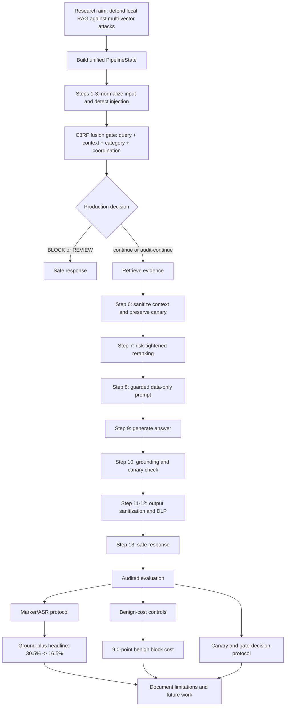
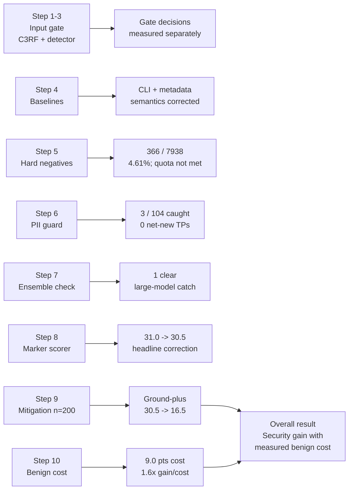
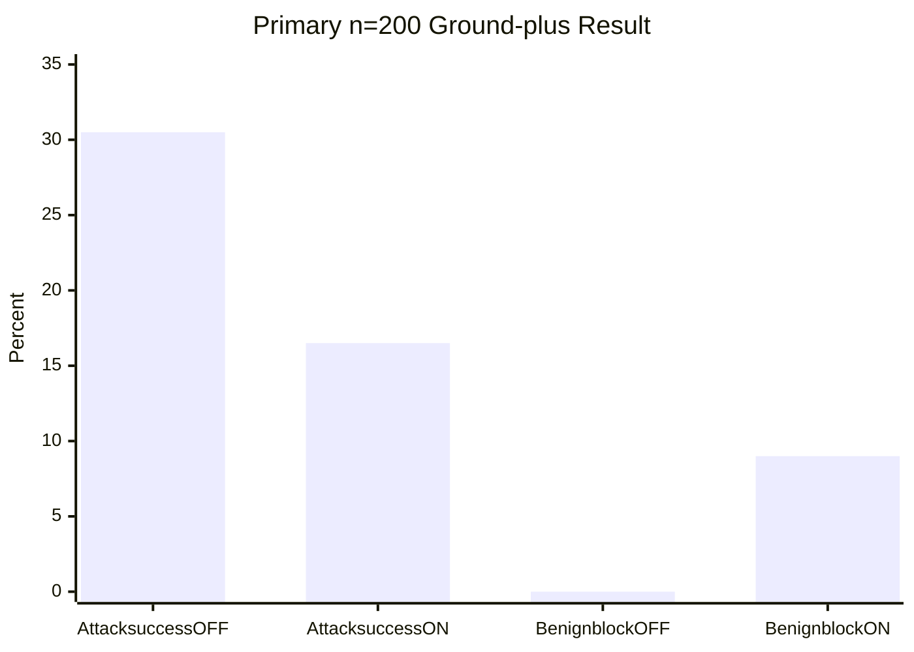

# Evidence-Guided Multi-Vector Defense for Retrieval-Augmented Generation

## Proposed Thesis Title

**Evidence-Guided Multi-Vector Defense for Retrieval-Augmented Generation: Adaptive Risk Propagation, Grounding Controls, and Audited Evaluation**

## What the Thesis Tried to Achieve

The project aimed to design and evaluate a local RAG security extension that can detect attacks expressed through multiple weak signals rather than relying on a single prompt-injection score. The intended defense should:

- fuse query, context, category, and coordination signals into an adaptive risk decision;
- propagate that risk through retrieval, sanitization, prompting, grounding, and output controls;
- resist direct prompt injection, poisoned context, and conjunctive or multi-vector attacks;
- preserve ordinary question-answering utility on benign traffic; and
- measure security gains and benign cost with reproducible, auditable artifacts.

## What Was Achieved

The project produced a working multi-stage local RAG defense pipeline, a frozen C3RF input gate, adversarial and benign evaluation harnesses, and a set of corrected result artifacts.

The most defensible n=200 mitigation headline is the **ground-plus** configuration:

- attack success rate: **30.5% -> 16.5%**;
- absolute reduction: **14.0 percentage points**;
- relative reduction: **45.9%**;
- paired McNemar test: **p = 2.46e-7**;
- benign block cost: **0.0% -> 9.0%**;
- security-gain / benign-cost ratio: **1.6x**.

The full configuration measured a stronger apparent ASR reduction, **30.5% -> 13.5%**, but its initial benign block cost was **45.0 points**. Further investigation identified a grounding-judge blind spot for terse polar answers induced by the full prompt-shaping path. That full-arm benign-cost interpretation remains provisional and is not used as the headline.

## System Progression



## Step-by-Step Research Progress

| Stage | Problem encountered | Change made | Evidence obtained |
|---|---|---|---|
| 1. Pipeline state | Risk and detector metadata were not consistently available to downstream stages. | Standardized a unified `PipelineState` carrying prompt, risk, context, ranking, answer, and trace fields. | Downstream stages can inspect the same row state; production and audit-continue modes are distinguishable. |
| 2. Input defense | A single detector score could miss attacks composed of individually weak query and context signals. | Added C3RF fusion and multi-vector risk propagation. | Detector fire-rate and downstream cascade behavior can be measured separately. |
| 3. Evaluation design | Production blocking prevented direct measurement of downstream behavior on would-be-blocked attacks. | Added production and audit-continue evaluation artifacts. | Gate decisions and downstream behavior are recorded without confusing serving behavior with audit behavior. |
| 4. Baseline comparison | The baseline runner passed the wrong scorer argument shape, and non-full profiles could blur the distinction between a detector that did not run and one that evaluated without firing. | Corrected scorer CLI arguments and made non-evaluated profiles omit multivector metadata rather than report a result. | Baseline slices rescored successfully and profile outputs now preserve evaluation status honestly. |
| 5. Hard-negative quota | The corpus contained 319 hard negatives in 7,963 rows, below the 5% target. | Verified raw schemas before patching: Jigsaw uses binary toxicity columns; AI4Privacy is unsafe by definition. Added source-safe adapters and a varied template pool. | The corrected miner produced 80 candidates; a degraded-source rebuild retained 366/7,938 and remained below quota because gated sources and `social_engineering` coverage were unavailable. |
| 6. PII guard | A proposed PII signal might improve recall but could add false positives. | Extended the validation harness to compare PII catch rate, benign costs, gate coverage, and net-new true positives. | PII signal caught 3/104 PII rows, cost 4.2% on hard negatives, and added 0 net-new TPs. It was not wired into the live gate. |
| 7. Ensemble comparison | A larger model ensemble appeared to refuse more rows. | Ran small and large ensemble outputs and compared rows individually. | Only index 3 was an unambiguous improvement; index 1 remained ambiguous and index 4 was exposed as a scorer artifact. |
| 8. Marker scorer audit | Word/digit mismatches and negation-blind marker matching misclassified correct answers. | Added numeric word/digit normalization and bounded refutation detection; aligned mitigation scorers with `attack_neutralized`. | The published 31.0% -> 18.5% headline was corrected to 30.5% -> 16.5% for ground-plus. |
| 9. Full versus ground-plus | Full had stronger measured ASR but an apparent 45-point benign cost. | Regenerated ground-plus benign controls at n=200 and inspected grounding traces. | Ground-plus cost 9.0 points with verbose answers; full's cost is provisional because terse polar answers receive poor topicality scores from the grounding judge. |
| 10. Self-audit | Supporting artifacts used different protocols and sample sizes. | Unified canary-based and marker/ASR-based results, labeling primary and secondary claims. | The thesis now has a ground-plus primary claim, a full secondary result, and explicit measurement caveats. |

## Results Chart

### Step Results At A Glance



### Numerical Step Results

| Step / evaluation | Input or sample | Result | Interpretation |
|---|---:|---|---|
| Input-gate and cascade validation | 220-row canary protocol | 169/220 overall protocol checks passed; benign controls 80/80 | Gate, canary, and downstream checks were measured as separate surfaces. |
| Baseline comparison | 130 rows/profile | Full 129/130 neutralized; LLMGuard-only 130/130; Spotlight-only 130/130 | Baseline scorer and profile metadata semantics were corrected before comparison. |
| Hard-negative quota | 7,938-row degraded-source build | 366 hard negatives, 4.61%; 5% quota not met | Source availability remains a reproducibility limitation. |
| PII guard probe | 104 PII rows; 104 benign-clear; 48 hard negatives | 3/104 PII catch rate; 0/104 benign-clear FPs; 2/48 hard-negative FPs; 0 net-new TPs | The extra PII signal was not added to the live gate. |
| Ensemble generalization | 8 semantic multivector rows | Small 3/8 neutralized; large 4/8; only index 3 was a clear improvement | Index 1 was ambiguous; index 4 was corrected as a scorer artifact. |
| Marker scorer correction | 200 planted rows | Original 31.0% OFF -> 18.5% was corrected to 30.5% OFF -> 16.5% for ground-plus | Numeric normalization and refutation handling changed the trusted headline. |
| Ground-plus mitigation | 200 planted attack rows | 61/200 -> 33/200 successes; 30.5% -> 16.5%; 14.0-point reduction; p=2.46e-7 | Primary security result. |
| Ground-plus benign cost | 200 clean QA rows | 0.0% -> 9.0% block rate; 11 broken / 3 fixed; 1.6x gain/cost | Primary utility trade-off. |
| Full mitigation secondary arm | 200 planted + 200 clean QA rows | 30.5% -> 13.5% ASR; apparent 45.0-point benign cost | Stronger apparent ASR, but benign cost remains provisional because of the terse-polar grounding blind spot. |

### Overall Result



**Overall conclusion:** the ground-plus configuration is the most defensible primary result. It cuts measured attack success from **30.5% to 16.5%** while increasing benign blocking from **0.0% to 9.0%**, giving a **14.0-point security reduction** and a **1.6x security-gain-per-benign-cost ratio**. The full arm remains secondary until its grounding-sensitive benign-cost measurement is independently replayed with preserved retrieval evidence.

### Thesis Figure Files

These SVG figures are generated from the verified JSON artifacts by [generate_thesis_figures.py](step4%20dataset/generate_thesis_figures.py):

- [Figure 1: Five-arm ASR comparison](step4%20dataset/thesis_figures/five_arm_asr.svg)
- [Figure 2: Security gain versus benign cost](step4%20dataset/thesis_figures/security_gain_benign_cost.svg)
- [Figure 3: Before/after scorer correction](step4%20dataset/thesis_figures/scorer_correction.svg)
- [Figure 4: Grounding scorer ablation](step4%20dataset/thesis_figures/grounding_scorer_ablation.svg)
- [Figure 5: Corpus source composition](step4%20dataset/thesis_figures/corpus_source_composition.svg)
- [Figure 6: Thirteen-stage pipeline architecture](step4%20dataset/thesis_figures/pipeline_architecture.svg)

Regenerate them from the workspace root with:

```powershell
python "step4 dataset\generate_thesis_figures.py"
```

### Primary n=200 Mitigation Comparison

| Configuration | ASR OFF | ASR ON | ASR reduction | Benign block cost | Gain / cost | Status |
|---|---:|---:|---:|---:|---:|---|
| Ground-plus | 30.5% | 16.5% | 14.0 pts | 9.0 pts | 1.6x | **Primary headline** |
| Full | 30.5% | 13.5% | 17.0 pts | 45.0 pts | 0.4x | Secondary; benign cost provisional |
| Ground-only | 30.5% | 26.5% | 4.0 pts | Not rechecked at n=200 | Not available | Ablation |
| No-refuse | 30.5% | 20.5% | 10.0 pts | Existing artifact only | Not final | Ablation |
| Refuse-only | 30.5% | 19.0% | 11.5 pts | Not rechecked at n=200 | Not available | Ablation |

### Earlier n=30v2 Ground-plus Check

This smaller experiment is retained as directional context, not as the primary headline:

- ASR: **43.3% -> 20.0%**;
- reduction: **23.3 points**;
- benign cost: **9.5 points**;
- paired McNemar: **p = 0.0233**.

It must not be mixed with the n=200 result.

## Measurement Corrections That Changed the Thesis

Three self-audits materially improved the reliability of the conclusions:

1. **Marker matching:** the original scorer missed digit/word equivalents such as `6` versus `six` and treated refuted planted markers as emitted. The scorer now normalizes numeric forms and detects local refutation cues.
2. **Mitigation report entry point:** the A/B scorer was aligned with the corrected `attack_neutralized` semantics so blocked rows are handled consistently.
3. **Grounding compatibility:** the full prompt-shaping path produces terse polar answers such as `Yes.`; the grounding judge's lexical and cross-encoder checks were designed for informative answers and therefore under-score these answers. The question-aware fix is implemented in the judge, but a full retrieval replay is not part of the final headline evidence.

## Limitations and Reproducibility Caveats

- The n=200 ground-plus headline is the primary claim; several supporting experiments remain n=8 or n=30 and should be described as directional.
- Full's 45.0-point benign cost is provisional because the stored rows do not preserve the ranked evidence needed for exact offline grounding replay.
- The hard-negative quota remains below target in the locally reproducible degraded-source environment: gated HuggingFace sources require authentication, and `social_engineering` is not registered in the source registry.
- Some experiments depend on Ollama, local model availability, CPU/GPU state, Windows Task Scheduler, and PowerShell behavior.
- The canary-based protocol and marker/ASR protocol measure different failure surfaces and should not be collapsed into one number.

## Thesis Contribution In One Sentence

This thesis demonstrates that a local RAG defense can combine multi-vector risk fusion with retrieval, grounding, and output controls, while showing through repeated instrumentation audits that trustworthy security claims require explicit benign-cost measurement, protocol separation, and correction of evaluation blind spots.

## Recommended Abstract-Level Claim

> On a 200-row planted-attack evaluation, the ground-plus defense reduced measured attack success from 30.5% to 16.5% while adding 9.0 percentage points of benign blocking, yielding a 1.6x security-gain-per-cost ratio. The study also audits and corrects marker-scoring and grounding-evaluation failure modes, and reports source-availability and protocol limitations explicitly.